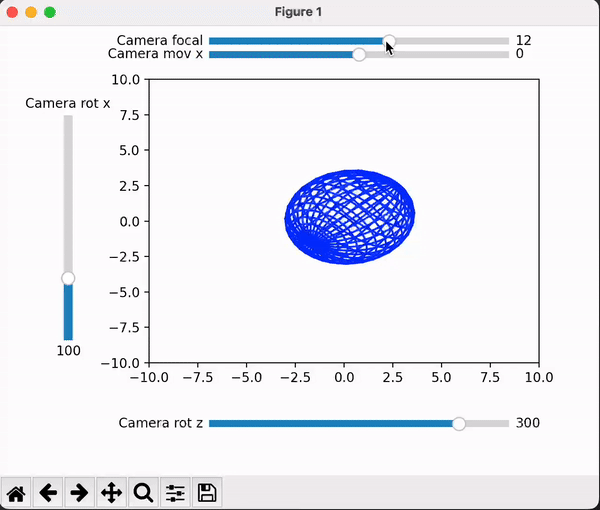

# FBXViewer

## Description

FBXViewer is a simple tool that visualizes the content in a FBX file. You can use it to display all different geometric bodies and 
use the predefined bars and the configurations to change the camera settings.

This tool is not aimed to visualize large geometric bodies as it is written using Python and matplotlib, and some functionalities may 
only be executable on Windows.

## Build

1. Clone the repository to your local disc with following command:

```bash
git clone https://github.com/Wind-yk/FBXViewer.git
```

2. Install conda or miniconda.
3. From terminal and under the `FBXViewer` project folder, use:

```bash
conda env create -f environment.yaml
```

4. After the installation, activate the Python environment with:

```bash
conda activate 3D
```

5. Check that you are running with the right interpreter from your IDE.

## Quickstart

Just use `python src/main.py` under `FBXViewer/` to check if a visualization of a sphere appears in a window. 

### Configuration

Configure the yaml file inside the `config` folder. It is primarily as follows:

```bash
configuration:

  name: "3D project"

  version: 0.1.0

  readFBX:
    fbx_path: ../../data/int/output.fbx
    overwrite: false
  
  Camera:
    shift: [0,0,-4]
    focal: 12
    angle: [100,200,300]
    scale: 1

  Display:
    winSize: [5, 5]
```

You can edit the path to the FBX file by changing the `fbx_path` that is under the section of `readFBX`; just keep in mind that the
execution script is `3D/src/main.py`. The predetermined `fbx_path` is set to be a sphere's graph that is included within the package.

**How to change the input FBX file:**
1. Add the FBX file into the path "data/int/". 
2. Replace the content in `fbx_path` with `./../data/int/<filename.fbx>`, where `<filename.fbx>` is the name of your input FBX file.
3. Save the modifications.
4. Execute using `python src/main.py`.

The `overwrite` parameter is set to be `false` so it won't modify the already existing json output file.

For more needs you can even modify the camera or the output windows size.

Remember that you shall **only** modify this `config.yaml` file for most of the cases.

### Rendering

The units of the output windows is the same as the default unit in the fbx file. The red line marked inside each bar is the
initial value of that parameter when first running the program. You can retouch these values to rotate, move, zoom in or zoom out the 
graph.



## Known issues

1. Low performance when rendering and refreshing.
1. FBX Converter only works on Windows and does not support the newest version of FBX. You can use blender to open and save the FBX file,
and then to convert it again. 
2. The visualization does not take into account the orientation of the camera, so some points of the geometric bodies may appear even if 
in theory they should be behind the camera.
3. Does not treat zero-division when transforming.
4. No logger implemented.

## Thanksgiving section

Special thanks to all authors of the references and to all possible users that may find this useful.

This FBXViewer project is implemented using some freetime of three undergraduates, mainly to experience the atmosphere when developing a 
software tool. For inconsistences you find, please report using the issues section.

## References and documentation

* [Development Documentation](docs/development.md)
* [FBX Format reference 1](https://banexdevblog.wordpress.com/2014/06/23/a-quick-tutorial-about-the-fbx-ascii-format/)
* [FBX Format reference 2](https://web.archive.org/web/20160605023014/https://wiki.blender.org/index.php/User:Mont29/Foundation/FBX_File_Structure)
* [Mathematical base](http://citmalumnes.upc.es/~julianp/lina/section-13.html)
